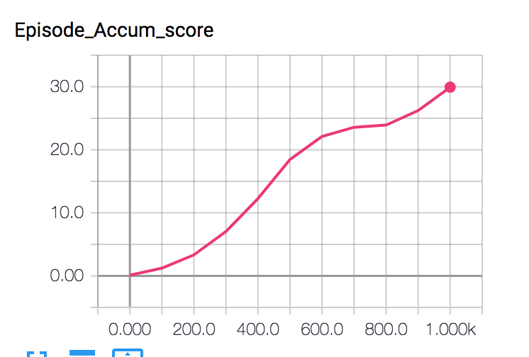
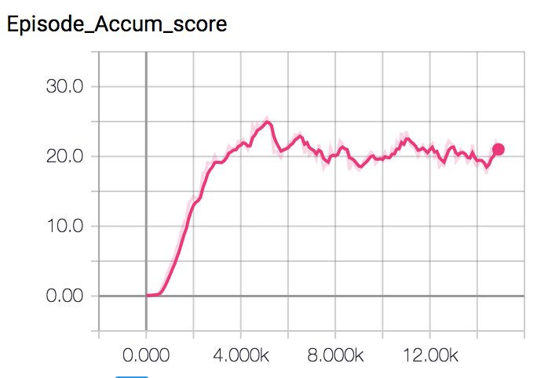
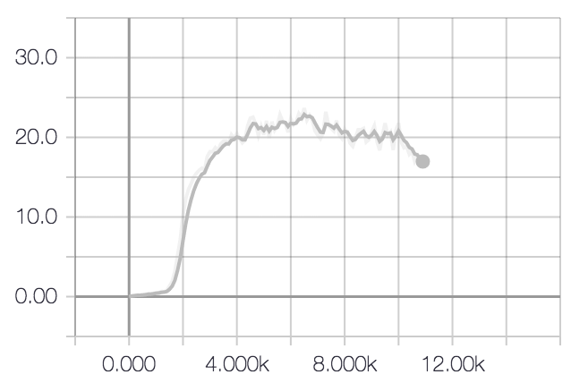
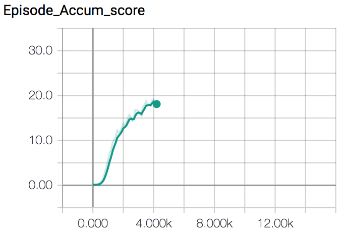

## Environment

* Number of agents: 20
* State Space: observation space consists of 33 variables corresponding to position, rotation, velocity, and angular velocities of the arm. 
* Action Space: Each action is a vector with 4 numbers, corresponding to torque applicable to two joints, 
values in action vector must be a number between -1 and 1
* Rewards: +0.1 for each step that the agent's hand is in the goal location
* Goal: maintain its position at the target location for as many time steps as possible

## Algorithm

Recent implementation of “Deep Q Network” (DQN) algorithm has acheived a signficant progress in Reinforcement Learning, resulting in human level performance in playing Atari games.
DQN is capable of solving problems with high-dimensional state space but faces limitations in dealing with high-dimensional continous action space and requires iterative optimazation process at each step.

For this experiment, I used a model-free, off-policy actor-critic algorithm using deep function approximators
that can learn policies in high-dimensional, continuous action spaces and uses some of the deep learning tricks that were introduced along with Deep Q-Networks.
This algorithm is fully explained in [Continuous control With Deep Reinforcement Learning](https://arxiv.org/abs/1509.02971) paper and it is built off Deterministic Policy Gradients to produce a policy-gradient actor-critic algorithm called Deep Deterministic Policy Gradients (DDPG).

### Agent

DDPG agent consists of 4 networks actor_network, actor_target_network, critic_network and critic_target_network. It starts by taking actions in epsilon-greedy manner and adding tuple of <state, action, reward, next_action, done> to its replay buffer. At every 10 steps (i.e. update_rate) it does a learning process by updating its local actor & critic network which includes backpropagation steps through each network to calculate gradients and finally applying a soft update to the target networks.

Actor nework has 3 hidden layer of 128 nodes with BatchNormalization layers in between each, it outputs actions for each state. Critic network consists of 3 hidden layers with 128, 128+action_size & 128 neurons which outputs a single value. both architectures use learning rate of 0.001 and Adam optimizer.

Other hyperparameters are:
  - buffer_size: 100,000 tuples, 
  - batch_size: 256
  - learning_rate_actor: 0.001
  - learning_rate_critic: 0.001
  - gamma (discount factor): 0.995
  - tau (soft update interpolation rate): 0.001
  
Agent is trained over 1,000 episodes and the average of 100 last episodes are plotted below (taken from my jupyter notebook experiment):

Episode: 0	Average Score: 0.1169999973848462 
Episode: 100	Average Score: 1.2344949724068865 
Episode: 200	Average Score: 3.3311149255437773 
Episode: 300	Average Score: 7.0623548421440655 
Episode: 400	Average Score: 12.269089725764479 
Episode: 500	Average Score: 18.465839587256312 
Episode: 600	Average Score: 22.123249505506827 
Episode: 700	Average Score: 23.575464473047292 
Episode: 800	Average Score: 23.927234465184615 
Episode: 900	Average Score: 26.221539413902907 
Episode: 1000	Average Score: 29.93400433092285 
Episode: 1014	Average Score: 30.001499329414223 

### Other experiments:

I tried multiple cconfigurations of hyperparameters both for single agent and multi-agent environments, none of the configurations could achieve 30. Reducing update_rate improved my model signficantly and helped agent learn faster, another improvement was acheived with batch_size of 256 which performed much better than 512. Here is my summary of hyperparameters along with score diagrams plotted from tensorboard:

<table style="width:100%">
  <tr>
    <td>- num_agents : 1  
  - actor network : 1 hidden layer 128 
  - critic network: 3 hidden layers 128, 64, 32 
  - update_rate: 100 
  - batch_size : 512</td>
    <td></td>
  </tr>
  <tr>
    <td>- num_agents : 1  
  - actor network : 2 hidden layers 128, 128 
  - critic network: 3 hidden layers 128, 64, 32 
  - update_rate: 200 
  - batch_size : 512</td>
    <td></td>
  </tr>
  <tr>
    <td>- num_agents : 20  
  - actor network : 2 hidden layers 128, 128 
  - critic network: 3 hidden layers 128, 64, 32 
  - update_rate: 100 
  - batch_size : 512</td>
    <td></td>
  </tr>
</table>
  

